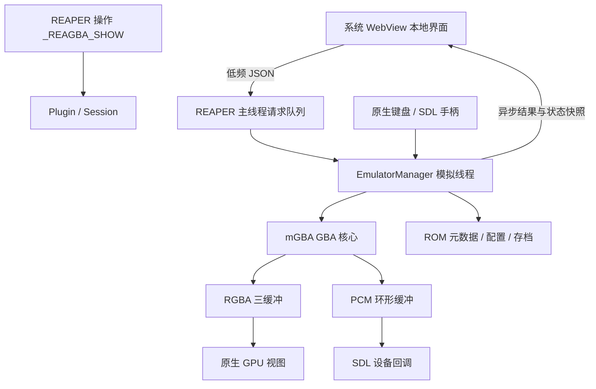

# 原生 REAPER 扩展架构

ReaGBA 仅集成 mGBA 的 GBA 核心，关闭 GB/GBC。REAPER 动态加载扩展时注册 `_REAGBA_SHOW`；执行命令创建一个 Session，再次执行激活同一窗口。卸载注销命令钩子和计时器并释放 Session。

## 宿主和进程

- Windows：扩展直接管理 WebView2 Controller 与 D3D11 子窗口；使用 REAPER 的事件循环。没有独立模拟器 EXE、Lua gfx 宿主或跨进程窗口嫁接。
- macOS：SWELL 创建 REAPER 可停靠容器，WKWebView 与 NSOpenGLView 是其原生子视图。SDK 的 SWELL 函数通过 REAPER 动态提供。
- Linux：扩展只使用 REAPER 的 SWELL/GDK API，不链接 GTK。独立 GTK3/WebKitGTK 辅助进程提供本地界面和 GtkGLArea，以 X11 窗口嵌入容器。控制通信为继承的 socketpair；帧通过继承的 memfd 共享。辅助进程没有 mGBA 或存档代码，不使用监听端口。

Linux 的共享帧使用进程共享的 robust mutex，生产者和消费者均 try-lock。渲染端持锁崩溃时恢复锁并丢弃该次帧，不阻塞 REAPER。父进程退出时关闭 socket、结束自己的辅助进程并释放共享内存。

## 线程与生命周期

REAPER 主线程持有容器、UI 请求队列与 WebView。消息回调只入队，低频 REAPER timer 每轮最多处理 32 个请求；Windows 原生窗口 timer、macOS NSTimer 或 Linux GTK timer 负责约 60 Hz 显示。

模拟线程独占 mGBA，执行 ROM 加载、每帧模拟与存读档。状态返回主线程再发送到 WebView，像素和 PCM 从不进入 JSON 或 JavaScript。主线程与模拟线程间用三缓冲交换最新画面；音频回调从 SPSC 环形缓冲读取，不操作核心、不分配或加锁。

关闭时停止宿主 timer 和输入，撤销 WebView 回调，join 模拟线程完成电池存档，再关闭 SDL 音频并释放 Manager。仅退出本 Session 初始化的 SDL 子系统，不对 REAPER 调用 SDL_Quit。Linux 的静态库符号隐藏，避免覆盖宿主或其他扩展的符号。

## 停靠、输入和布局

`DockWindowAddEx / DockWindowRemove / DockWindowActivate` 在同一个容器上切换 Docker 与浮动窗口，不重建核心。停靠状态保存到 REAPER ExtState；ROM 和进度独立于 REAPER 工程。

键盘处理在原生层完成：Windows VK/scancode + WebView2 AcceleratorKeyPressed；macOS NSEvent 物理 scancode；Linux GTK 按键事件通过本地 IPC 送到扩展。只接受 ReaGBA 焦点内的输入，搜索和设置时屏蔽游戏键；短按保留到下次轮询，失焦清空。R 加速用独立标志，松开恢复原倍率。

页面保持上下布局。DOM 计算 3:2 游戏区、库列表高度与裁剪矩形，宿主将矩形转换为实际像素。Windows 用窗口区域留出 D3D 视图，macOS/Linux 将原生 GL 视图放在对应位置。只传递矩形，不传像素。分隔条比例通过 `library_split` 保存，窄高窗口的剩余空间用于列表，画面不会被拉成长黑框。

## 本地界面和持久化

`prepare_ui.py` 校验并原样复制 `index.html`、`style.css`、`app.js`；这三份 UI 源文件可以直接放入安装目录的 `web` 使用，不依赖网络服务或内联构建步骤。扩展会确认三份文件齐全，并只从 REAPER 资源目录 `Scripts/zaibuyidao Scripts/ReaGBA/web` 加载界面。宿主拒绝外部导航、新窗口和 WebView 权限请求。控制队列有数量和字节上限，协议使用请求 ID 匹配异步结果。

ROM 保持只读。`RuntimePaths` 把全部数据固定到资源目录 `Scripts/zaibuyidao Scripts/ReaGBA`，不兼容旧数据地址。ROM 游戏文件夹和最后一次文件选择位置保存在 `config/preferences.json`。存档按 ROM SHA-256 区分，包含核心版本和完整性检查。写入先完成临时文件，再替换目标文件。测试通过显式环境变量隔离数据，诊断输出不会进入发布包。

## 目录

`src/extension` 是扩展和各平台宿主；`src/reaper` 是最小 REAPER API 绑定；`src/core` 是 mGBA 适配器；`src/app` 管理模拟线程；`src/bridge` 处理控制命令；`src/video`、`audio`、`input`、`save`、`rom` 分别负责相应原生模块。

构建默认只生成扩展及开发验证程序。CMake 安装组件 ReaGBA 和发布脚本均明确选择分发文件，禁止将整个构建目录直接打包。
